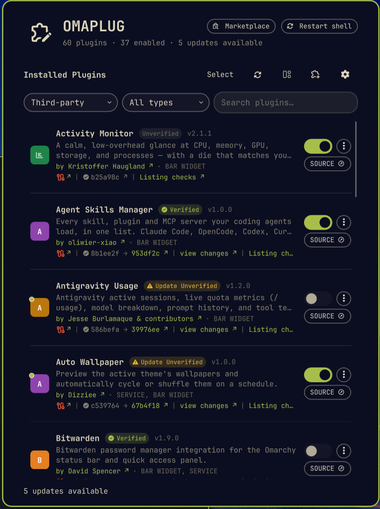
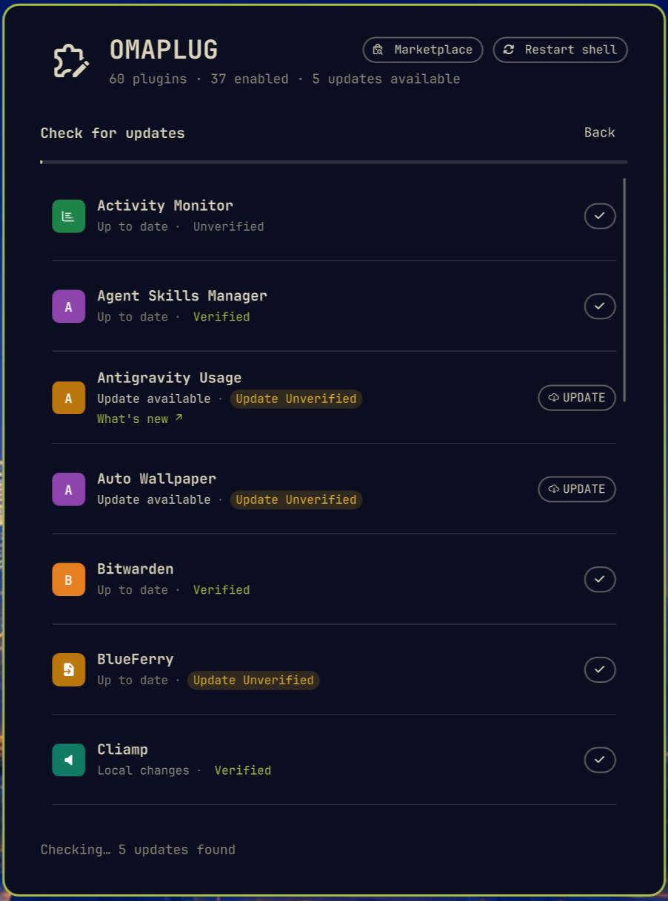
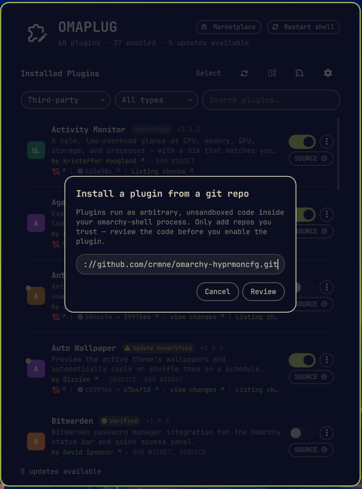
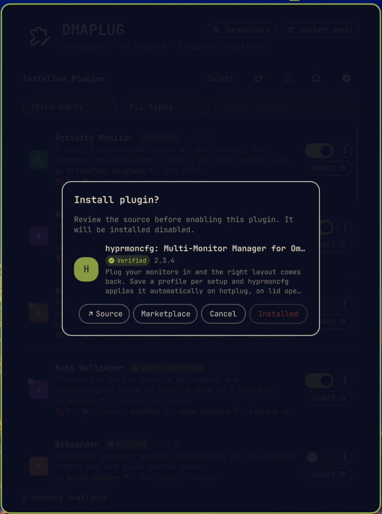
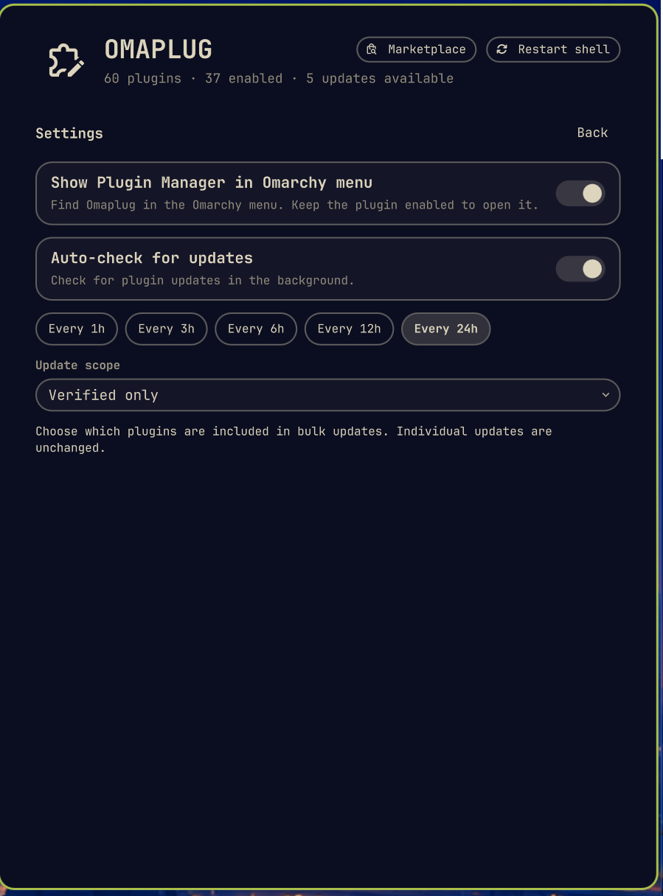
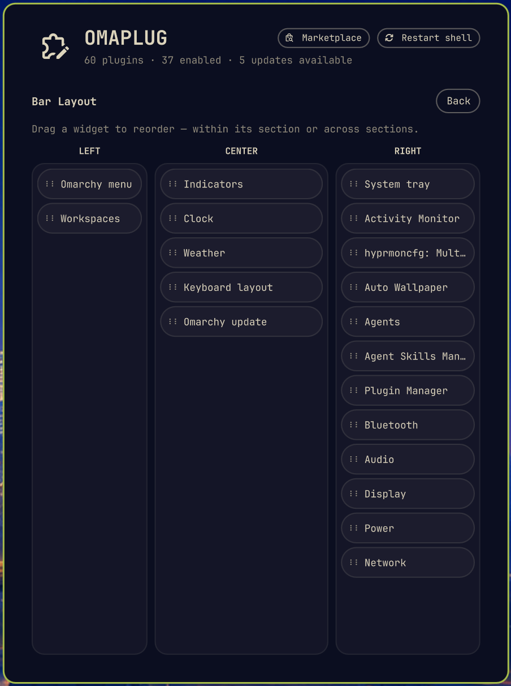
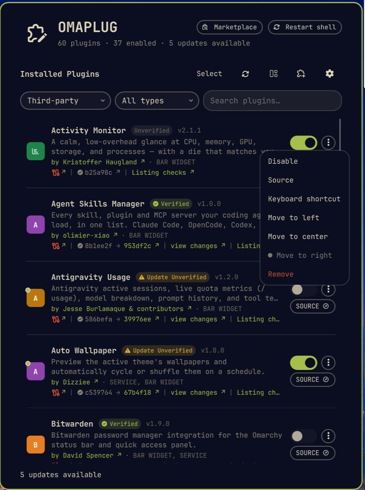
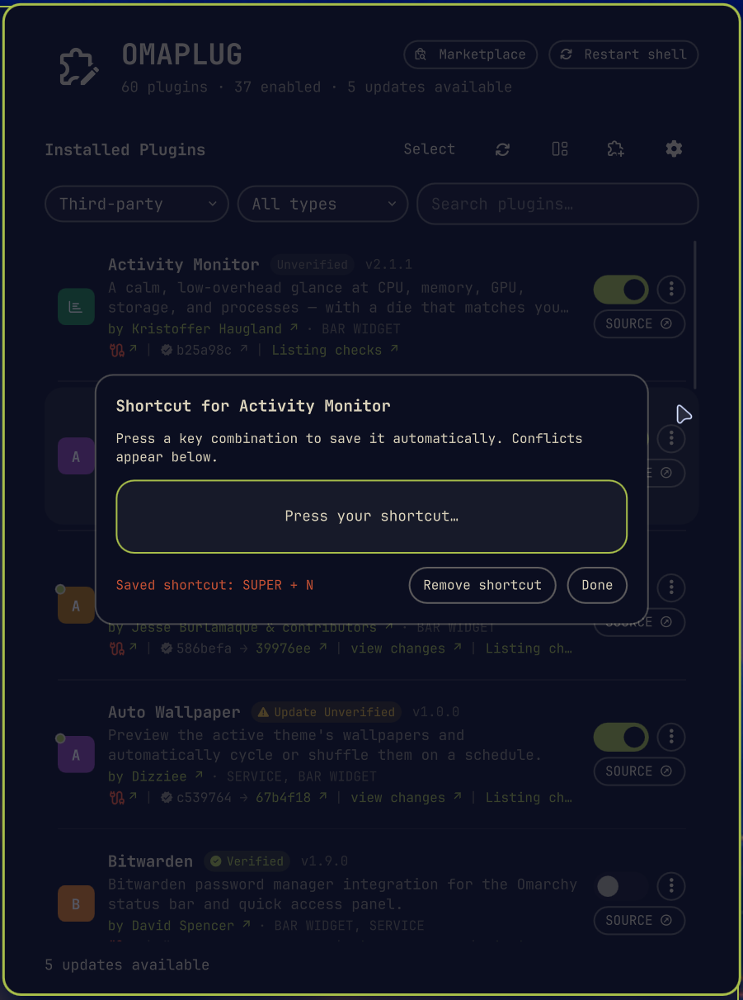

# 🧩 Omaplug

**A small tool for managing your Omarchy plugins.**

[](https://plugins.omarchy.org/plugin.html?id=omaplug) [](https://github.com/omacom/omarchy-plugin-marketplace/blob/main/SECURITY.md#automated-security-baseline) [](https://stats.ussego.com/plugins/omaplug) [](https://stats.ussego.com/plugins/omaplug) [](https://stats.ussego.com/plugins/omaplug)

Access it right from the Omarchy bar — it gives you a centralized place to view and organize the plugins you have installed. Here are a few things you can use it for:

- Easily turn individual plugins on or off as needed.
- Check for available updates and update them individually — or all at once.
- Remove plugins individually, or several in one go.
- Jump straight to each plugin's repo, or browse the [Omarchy marketplace](https://plugins.omarchy.org).

Omaplug is listed on the marketplace: [plugins.omarchy.org/plugin.html?id=omaplug](https://plugins.omarchy.org/plugin.html?id=omaplug)

## Screenshots


<table>
  <tr>
    <td align="center"></td>
    <td align="center"></td>
    <td align="center"></td>
  </tr>
  <tr>
    <td align="center">Plugin list</td>
    <td align="center">Checking for updates</td>
    <td align="center">Install dialog</td>
  </tr>
  <tr>
    <td align="center"></td>
    <td align="center"></td>
    <td align="center"></td>
  </tr>
  <tr>
    <td align="center">Plugin install review</td>
    <td align="center">Settings</td>
    <td align="center">Bar layout</td>
  </tr>
  <tr>
    <td align="center"></td>
    <td align="center"></td>
    <td></td>
  </tr>
  <tr>
    <td align="center">Row action menu</td>
    <td align="center">Keyboard shortcuts</td>
    <td></td>
  </tr>
</table>

## What it can do

- **🔌 Enable / disable** — every discovered plugin (Omarchy's own and third-party) gets a simple toggle. Flipping it goes through the same registry the `omarchy plugin enable/disable` command uses, so what you see here is always what's really running.
- **🔄 Check for updates** — scans every installed third-party plugin and distinguishes clean updates from local plugins, symlinked development plugins, local changes, and genuine fetch errors.
- **⬆️ Update (or update everything)** — apply one update, or finish every proven-safe pending update from a single click, even while Omarchy reloads changed plugins.
- **🛡️ Review before installing** — inspect a plugin's icon, name, version, description, source, and marketplace status before installation.
- **⚙️ Configure updates and launcher access** — choose automatic update checks, bulk-update scope, and whether Omaplug appears in the Omarchy Apps menu.
- **⌨️ Set plugin shortcuts** — assign per-plugin keyboard shortcuts with live conflict checking.
- **📊 See clear plugin status** — distinguish Verified, Unverified, Update Unverified, and unlisted plugins.
- **↔️ Arrange the bar** — reorder bar plugins and access their actions from a clearer management layout.
- **➕ Install** — paste a git repo URL and add a plugin in one step. It'll warn you first that plugins run as unsandboxed code, because honesty is the default here.
- **🗑️ Remove** — third-party plugins only. Trash one, or enter Select mode to check several and remove them all at once (with a confirmation, no accidents).
- **🔗 Source link** — every git-managed plugin gets a `SOURCE` button that jumps straight to its repo page.
- **🔍 Search & filter** — narrow the list to Omarchy plugins, third-party plugins, or search by name, description, ID, author, or kind.
- **♻️ Restart shell** — if a plugin ever acts up from stale compiled code, one button clears the QML cache and restarts the shell so everything reloads fresh.

## Install

```bash
omarchy plugin add https://github.com/fross100/omaplug --enable
```

## Settings

Click the gear to the right of Install. **Show Plugin Manager in Omarchy menu** adds a searchable menu entry when switched on, and removes it when switched off. It is off by default and preserves your other menu entries and comments. Omaplug must remain enabled and available on the bar for this shortcut to open its popup.

Settings also provides the automatic update check switch and interval.

**Update scope** controls bulk updates: **Verified only**, **Verified + Update Unverified**, or **All plugins** (the default). The bulk-update button changes its label to match. Individual updates remain available regardless of the scope. For a repository containing several plugins, all must match the selected scope for a bulk update.

## Plugin keyboard shortcuts

Choose **Keyboard shortcut** from a plugin's **⋮** menu, then press your desired combination, such as `Super + Ctrl + Alt + P`. Omaplug checks live Hyprland bindings and saves automatically if the combination is free. If it is taken, the existing shortcut stays unchanged and you can press another combination. **Remove shortcut** removes only that plugin's Omaplug-managed binding. **Done** or Escape closes the recorder.

This editor uses Omarchy's `~/.config/hypr/bindings.lua`, preserves existing bindings, and reloads Hyprland after a change. It refuses conflicting or unresolved physical-key combinations. Plugins must remain enabled; bar widgets must stay on the bar and expose a working popup. Hiding bar icons is not part of this feature.

## Update

Update Omaplug with Omarchy's plugin command:

```bash
omarchy plugin update omaplug
```

Review the changes when prompted, then confirm the update. To accept it automatically, add `--yes`:

```bash
omarchy plugin update omaplug --yes
```

## Remove

If you enabled the menu shortcut, first turn off **Settings → Show Plugin Manager in Omarchy menu**.
Remove any keyboard shortcuts assigned through Omaplug before uninstalling their plugins.

```bash
omarchy plugin remove omaplug
```

## Remove manually

No terminal? No problem — or maybe you just like doing things the hands-on way. Here's how to remove it by hand:

1. Delete the plugin folder:

```bash
rm -rf ~/.config/omarchy/plugins/omaplug
```

2. Remove the `"id": "omaplug"` entry from the bar layout in `~/.config/omarchy/shell.json`.

3. Restart the shell to apply:

```bash
omarchy-restart-shell
```

## Requirements

- Omarchy 4.x
- Quickshell
- `git`, `jq`, `python3`, and the `omarchy` CLI
- Standard coreutils (`setsid`, `nohup`, `timeout`, `sed`)

## License

[MIT](LICENSE) © 2026 Fross
